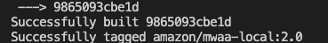

# About Automating DAG deployment

This repository provides general guidelines for automating the deployment of your DAG to Amazon MWAA environment so that You can build quality DAGs and deploy them faster.

## What this repo contains

```
├── build
│   ├── buildspec.yaml           ## Run by AWS CodeBuild
│   ├── local-runner.py          ## Runs local runner and executes test
│   └── plugin-versioning.py     ## Copies plugins.zip/requirement.txt to S3 
│                                   updates versionId in param file
├── dags
│   ├── hello-mwaa.py            ## sample dag
│   └── requirements.txt         ## Additional Python dependancies
├── infra
│   ├── parameters               ## parameters for MWAA stack. one for each ENV
│   ├── pipeline.yaml            ## IaC for pipeline
│   └── template.yaml            ## IaC for MWAA env
├── plugins                      ## Plugins
    ├──.....    
└── test                      
    ├── __init__.py
    ├── dag-validation.py        ## DAG integrity test
    └── dags                     ## DAG Unit test
```
## Getting started
### Prerequisites

- Create S3 bucket for storing DAGS. [Here](https://docs.aws.amazon.com/mwaa/latest/userguide/mwaa-s3-bucket.html) is the doc on creating S3 bucket for MWAA. You can simply follow the commands here as well.

```bash
aws s3api create-bucket --bucket {bucketname} --create-bucket-configuration LocationConstraint={region}
aws s3api put-bucket-versioning --bucket {bucketname} --versioning-configuration Status=Enabled
aws s3api put-public-access-block --bucket {bucketname} --public-access-block-configuration "BlockPublicAcls=true,IgnorePublicAcls=true,BlockPublicPolicy=true,RestrictPublicBuckets=true"

```

#### Prepare images

We use MWAA local image and Postgres image for testing the DAGs and dependancies. These images are built and pushed to ECR repo. During the test phase, CodeBuild job runs ./build/local-runner.py to download the images from ECR and runs them. If you prefer to use a different registry, You can. Just change the code in build/local-runner.py to use the registry.

- Login to ECR
```bash
aws ecr get-login-password --region {region}  | docker login --username AWS --password-stdin {account}.dkr.ecr.{region}.amazonaws.com
```
- Build [MWAA local runner](https://github.com/aws/aws-mwaa-local-runner) and push to ECR repo. Follow the instructions in MWAA local runner repo to build the image for version 2.0.2 of the MWAA. Here are the commands you will be running.
```bash
git clone https://github.com/aws/aws-mwaa-local-runner.git
cd aws-mwaa-local-runner
./mwaa-local-env build-image
```
You will see the imageId at the end of the build process like shown in the pic below



You can also use the following command
```bash
docker image ls | grep mwaa-local
```
if you have just one image, you can use
```bash
docker image ls | grep mwaa-local | awk '{print $3 }'
```

 Create an ECR repo and push the image to your ECR repo. if you are not using ECR, you will have to change the registry info in build/local-runner.py. 

```bash

aws ecr create-repository --repository-name mwaa-local --image-tag-mutability MUTABLE --image-scanning-configuration scanOnPush=true

docker tag {imageid} {account}.dkr.ecr.{region}.amazonaws.com/mwaa-local:2.0.2
docker push {account}.dkr.ecr.{region}.amazonaws.com/mwaa-local:2.0.2

```

- Push Postgres container to ECR. This step is to avoid rate limiting errors with anonymous logging. If you would like to stick to Postgres image in docker hub, Refer [A few things to know]()

```bash
  docker image pull postgres:10-alpine
```
Search for the image to capture the image ID 
```bash
  docker image ls | grep "postgres" |  awk '{print $3 }'
```
 Create an ECR repo and push the image to your ECR repo. if you are not using ECR, you will have to change the registry info in build/local-runner.py. 

```bash
  aws ecr create-repository --repository-name mwaa-db --image-tag-mutability IMMUTABLE --image-scanning-configuration scanOnPush=true

  docker tag {imageid} {account}.dkr.ecr.{region}.amazonaws.com/mwaa-db:10-alpine
  docker push {account}.dkr.ecr.{region}.amazonaws.com/mwaa-db:10-alpine

```
- Create an AWS CodeStar connection for connecting to your GitHub repo

```bash
aws codestar-connections create-connection --provider-type GitHub --connection-name MWAA-GitHub-connection.
```
Note down the ARN. This will be used in the command later for creating the pipeline.
After creating the connection, Follow the instructions [here](https://docs.aws.amazon.com/dtconsole/latest/userguide/connections-update.html) to update the pending connection.


### Create your Repo

 Clone the repo. Create your own data pipeline repo as the folder structure mentioned before. Copy the infra and build  directory to your source code and commit your source code to a GitHub repo.

### Modify parameters
 infra/parameters/{ENV}.json - update the S3 bucket with the bucket name created in the prerequisite step. Leave other parameters as such. Requirements and plugins version will be updated during build process

### Create the build pipeline

```bash
aws cloudformation create-stack --stack-name mwaa-cicd  --template-body file://infra/pipeline.yaml  --capabilities CAPABILITY_AUTO_EXPAND CAPABILITY_IAM --parameters ParameterKey=CodeRepoName,ParameterValue={CodeRepoName} ParameterKey=MWAASourceBucket,ParameterValue={MWAASourceBucket} ParameterKey=GitHubAccountName,ParameterValue={GitHubAccountName} ParameterKey=CodeStarConnectionArn,ParameterValue={CodeStarConnectionArn} ParameterKey=PYCONSTRAINTS,ParameterValue={ConstraintsFileLocation}

```
see example below
``` bash
aws cloudformation create-stack --stack-name mwaa-cicd  --template-body file://infra/pipeline.yaml  --capabilities CAPABILITY_AUTO_EXPAND CAPABILITY_IAM --parameters ParameterKey=CodeRepoName,ParameterValue=test ParameterKey=MWAASourceBucket,ParameterValue=airflow2.0-us-east-1 ParameterKey=GitHubAccountName,ParameterValue=accountname ParameterKey=CodeStarConnectionArn,ParameterValue=arn:aws:codestar-connections:us-east-1:1234567890:connection/15e9ee86-1082-479a-a9ed-38ca8c680046  ParameterKey=PYCONSTRAINTS,ParameterValue=https://raw.githubusercontent.com/apache/airflow/constraints-2.0.2/constraints-3.7.txt
```

You can access the pipeline by accessing AWS Codepipeline console. You can start the pipeline from there or modify code and commit to your source code repo.


## A few things to know
- All tests are inside the test folder. One of the DAG integrity test checks the load time to be .5 sec or less. You can change it in test/dag_validation.py
- requirements.txt is inside the dags folder. If you prefer a different location, make sure you update wherever it is referenced.
- Adding constraints file is requirements in a [best practice](https://docs.aws.amazon.com/mwaa/latest/userguide/best-practices-dependencies.html) and the test expects a constraints file in requirements. The file location can be configured as a paramater to the infra/pipeline.yaml. You can place your constraints in plugins and refer as /usr/local/airflow/plugins/{constraints file}.
- If you prefer to create MWAA without NAT and use only VPCEndpoints, You can use the template infra/template-private-vpcendpoints.yaml. This disallows any outbound access to internet.
- You can use the postgres image from docker.io directly. You might run into [rate limiting issue](https://www.docker.com/increase-rate-limits#:~:text=The%20rate%20limits%20of%20100,the%20six%20hour%20window%20elapses.) with codebuild downloading Postgress image if you are using guest account. 

    You can store the docker hub credential in secretmanager and use it to login to docker hub. This will require change in CodeBuild role, build/buildspec.yaml as well as build/local-runner.py
```bash
env:
  secrets-manager:
    DOCKERHUB_PASSWORD: "/docker/credentials:password"
    DOCKERHUB_USERNAME: "/docker/credentials:username"
phases:
  pre_build:
    commands:
      # run test
      - python3 build/local-runner.py $REGION $ACCOUNT_NUMBER `pwd` dags/requirements.txt ${PY_CONSTRAINTS} $DOCKERHUB_USERNAME $DOCKERHUB_USERNAME

```

- The example here are all for 2.0 version of MWAA. You can very well do the same process for 1.10.12. You will just need to build the 1.10.12 version of the image and use it in the local-runner.py

## Security

See [CONTRIBUTING](CONTRIBUTING.md#security-issue-notifications) for more information.

## License

This project is licensed under the Apache-2.0 License.

